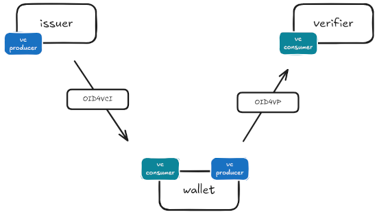
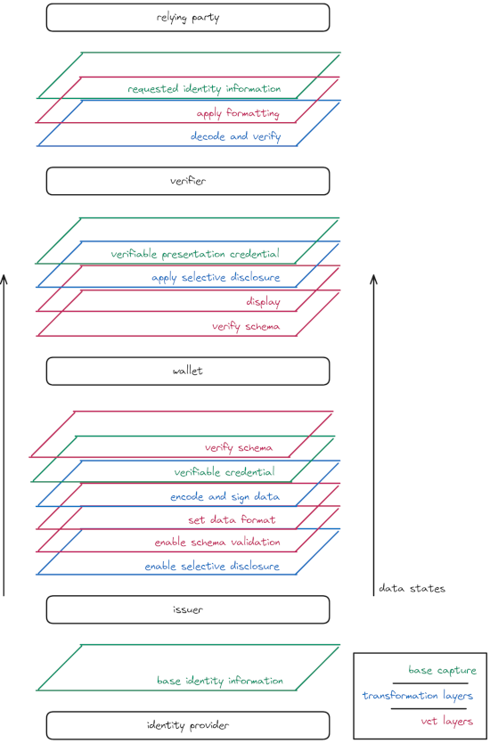

# (WIP) Overall picture

<div class="emphasis">

`vct` is a claim (__Verifiable Credential Type__) that links to format, display, and object schema storage which __help in the associated credential different representations__.

Available to __distributed producers and consumers__ through a registry it give means for a credential to __check its integrity, display it, and use it in a standard way__.

</div>

### SD JWT Example

#### Token
```
eyJ0eXAiOiJ2YytzZC1qd3QiLCJhbGciOiJFUzI1NiJ9.eyJjbmYiOnsiandrIjp7Imt0eSI6IkVDIiwieCI6IjI3d2pOSEhtWUYwZUthcHpVUUFnV2pwdUlyck0waHYxUnp3Q090NHhKR2siLCJ5IjoiRnhrZGQtSWdoQllxMmRrRnNnZUVpWlN0cjRHUmNsQnRfZzE0TmFwaW1COCIsImNydiI6IlAtMjU2In19LCJ2Y3QiOiJ1cm46d3d3YWxsZXQ6dGVzdCIsImp0aSI6InVybjp2aWQ6OTU2MTFhMWUtNzNjZi00ZmE3LThhMjctZjE0YzgyNTFhNTRlIiwiaWF0IjoxNzQxMTA2OTc1LCJleHAiOjE3NzI2NDI5NzUsImlzcyI6Imh0dHA6Ly93YWxsZXQtZW50ZXJwcmlzZS1pc3N1ZXI6ODAwMyIsInN1YiI6Ilhxcko1My13anNCWjNBUmlzQnJ1dmRwRk9qdnRSWGxMZzNmUWJuZmJfbVUiLCJfc2RfYWxnIjoic2hhLTI1NiIsIl9zZCI6WyJJRXZWdTRmUnNMSWd3OWlRaUJmQ2t3Tm5Nb1pObndPdVI1Wjd2dXFQQ1pFIl19._1xkVCcKRSTMBTIGps4pwRGIVQUNtN5sQjQ0I023Jg4FbVMalNawRn6yVIWlt_Y3cKG8JRdhPT6bd_fxNLLDQQ~WyIxLmFhenF1cjd2emQiLCJzb21lS2V5IiwiU29tZVZhbHVlIl0~
```

#### Payload
```json
{
  "cnf": {
    "jwk": {
      "kty": "EC",
      "x": "27wjNHHmYF0eKapzUQAgWjpuIrrM0hv1RzwCOt4xJGk",
      "y": "Fxkdd-IghBYq2dkFsgeEiZStr4GRclBt_g14NapimB8",
      "crv": "P-256"
    }
  },
  "vct": "urn:wwwallet:test", // <-----
  "jti": "urn:vid:95611a1e-73cf-4fa7-8a27-f14c8251a54e",
  "iat": 1741106975,
  "exp": 1772642975,
  "iss": "http://wallet-enterprise-issuer:8003",
  "sub": "XqrJ53-wjsBZ3ARisBruvdpFOjvtRXlLg3fQbnfb_mU",
  "someKey": "SomeValue"
}
```

## About schema

Schema were originally first class citizen in the Self-Sovereign Identity designs, described as claims definitions to be included in the credentials, both available in a ledger. Credentials would then be based on those schemas to define data format and semantics for each claim. This notion of schema is defined with [Overlay Capture Architecture (OCA)](https://oca.colossi.network/) to give a formal definition for claims.

Whereas Media Types ([Multipurpose Internet Mail Extensions (MIME) Part Two: Media Types](https://www.rfc-editor.org/rfc/rfc2046.html)) define an inclusion of the type within a message, Overlay Capture Architecture states data digital representations semantics separation of concerns for Producers and Consumers. Here, Verifiable Credentials Types are the claims definitions providing decentralized representations for SD JWT credentials with the objective to enhance credentials with validation and representational abilities.

From a capture base of an entity, overlays are applied to provide the wanted representation of it, an entity being a set of claims. It helps having decentralized semantics, different representations at different locations, for a given entity. Here we can take a credential as a base to apply different layers like semantics (vct), conformance (vct schema validation) signature (provenance and integrity) or subset (selective disclosure / presentation_definition).

### Verifiable credentials producers and consumers



As stated by OCA, the entities that use vct metadata as schema can be both verifiable credentials producers or consumers. vct metadata purpose is different from one side to the other, ensuring integrity for the vc producers and ensuring good usage for the vc consumers. Different overlays are applied in a distributed way to have the proper representation according to producers and consumers purpose.

## Self-Sovereign Identity overlays

<div class="inline-schema">



### Identity provider

Identity providers are the source of the identity information.

They have means to store and expose functions to retrieve that information. They provide the base capture of the identity information to be exposed for the issuance, the wallet storage / presentation, and the verifier identity use.

### Issuer

Issuers are exposing identity information as verifiable credentials.

The consumers would have the ability to verify the credential provenance, providing trust for them. SD JWT provide that identity information encapsulation to have exposition abilities such as selective disclosure to ensure privacy or schema to enable integrity, proper display or representation of the information. __Schema, display, and format is set given the `vct` claim__ of the SD JWT token and can be resolved using a registry.

### Wallet

Wallets are to store verifiable credentials while proving the holder ownership and to present them.

The holder have a __visual representation of the verifiable credential__ to accept and store it. The `vct` is part of that representation. Once __integrity ensured__ and the credential stored, the latter can be presented applying SD JWT selective disclosure to enable privacy. The holder's kept identity information would have later use by verifiers.

### Verifier

Verifiers are consumers of identity information in its credential representation.

SD JWT credentials can be requested to a wallet, they can be __formatted for standard identity information usage__ given by the `vct` through a registry. Mostly acting as relying parties that use the identity information according to purposes, they ensure identity information provenance and ownership.

### Relying party

Relying parties are consumers of identity information according to a purpose.

</div>
