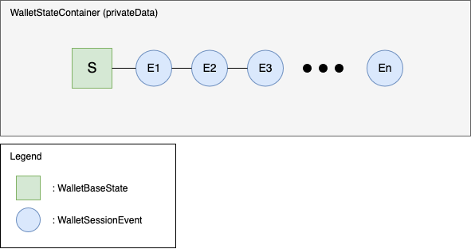
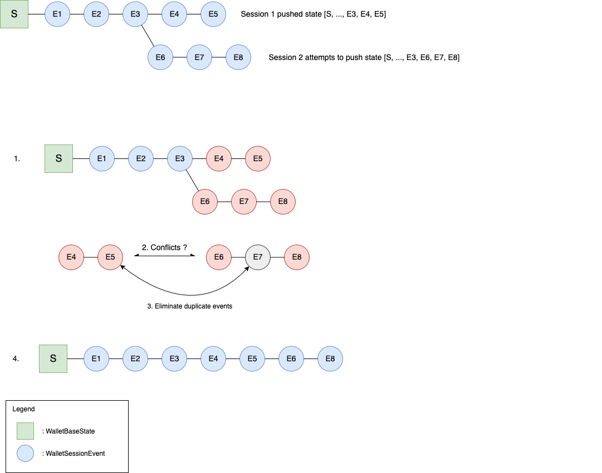

# Data model

This document is based on the [wallet-frontend PR #740][fe-pr-e2ee] description, lightly edited.


## Introduction

This implementation leverages the Event Sourcing model for managing wallet session state. Instead of persisting every event indefinitely, this implementation maintains a WalletBaseState as the starting point and apply a sequence of WalletSessionEvents stored in memory. The current state is derived by reducing these events over the base state using the map-reduce pattern.

By reducing a sequence of session events over a known base state, this approach achieves fast state rehydration, which is critical for responsive in-memory operations. Additionally, the use of reducer functions enhances testability, allowing to verify state transitions in isolation with minimal overhead. The model is also extensible, as new event types or behaviors can be integrated by extending the reducer logic without altering the overall architecture.

## Summary of introduced features

- State synchronization across devices
- Client-side encrypted storage for credentials, presentations, settings and state


## Details

The wallet state consists of a `WalletBaseState` S,
and a list of events as illustrated by the following figure.




S: `WalletBaseState`
- keypairs
- credentials
- presentations
- settings
- credential issuance session states

events: `List<WalletSessionEvent>` (E1, E2, ..., En)
- Describes a change to S (`WalletBaseState`)
- `parentHash`: hash of previous event
- ...other metadata


Current state is S + E1 + E2 + ... + En, recomputed each time the encrypted container is opened (on each page load)

Events older then some threshold, get folded into the S (`WalletBaseState`)

```
S' = apply(S, events[0])
events = events[1:]
```





### Conflict detection

Utilize `ETag` header for conflict detection

On fetch: save `ETag` header in frontend state
- Backend sets response header `ETag: Hash(encrypted blob)`
- Frontend saves `ETag` in app state

  ```
  latestEtag = response.headers['ETag']
  ```

On push: send request header `X-Private-Data-ETag: <latestEtag>`
- Backend compares:
  ```
  Hash(currentPrivateData) == X-Private-Data-ETag
  ```
- if match: success
- if not matched: conflict
- Frontend must re-fetch and resolve conflict (on later PR)


### Conflict resolution

The above diagram provides an illustrative example.
The resolution steps as numbered in the diagram are:

 1. Use `parentHash` to determine the point of divergence

    In the example case, `Hash(E3)` is the latest `parentHash` that appears in both event lists

 2. Resolve conflicts between E4...E5 and E6...E8

     1. New Credential Event: keep both if `credentialId` differ
     2. Delete Credential Event: keep both if `credentialId` differ. Discard if duplicate `credentialid`
     3. New Keypair Event: keep both
     4. Delete Keypair Event: Discard if duplicate `kid`
     5. Alter Settings Event: Keep the one with the latest timestamp
     6. New Credential Issuance Session: Keep both
     7. New Presentation Event: keep both

 3. De-duplicate events: E7 duplicates E5

 4. After conflict resolution, replay E6, E8 after E5


>Note: The implementation at this point did not handle the cases of offline scenarios where merging of divergent states can occur. This functionality will be introduced later.


### Code versioning

_This section is new since [wallet-frontend PR #740][fe-pr-e2ee]._

The data model is implemented in [`WalletStateSchema.ts`][schema-ts] and related files.
Each version of the data model has a concrete versioned module, for example `WalletStateSchemaVersion1.ts`,
which defines data types and functions for operating on events for that schema version.
Concretely, these consist of:

- Type definitions of `WalletStateContainer`, `WalletState` and `WalletSessionEvent`,
  and any required member types.

  `WalletStateContainer` is always on the form:
  ```ts
  export type WalletStateContainer = {
      events: WalletSessionEvent[];
      S: WalletState;
      lastEventHash: string;
  };
  ```

  In schema version 1, `WalletSessionEvent` and `WalletState` are both concrete singular types.
  In later schema versions these are "version X or earlier" union types,
  since `events` may contain events of earlier schema versions not yet folded into `S`,
  and the last event folded into `S` may also have been of an earlier schema version.
  Therefore, both `S` and `events` may be of the current or any earlier schema version.

- Reducer functions for applying events to states.
  These functions have signatures on the form `(S, E) => S`, where `S` is the state type and `E` is the event type.

  The `(WalletState, WalletSessionEvent) => WalletState` reducer
  should always set `WalletState.schemaVersion` to the value of `WalletSessionEvent.schemaVersion`.

- Merge strategies for de-duplicating events during conflict resolution.
  These are functions that take two lists of events of a particular type,
  and return a new list that is the de-duplication result.
- A hash function for hashing events.
  This is used to set the `parentHash` of child events, and the `latestEventHash` of the `WalletStateContainer`.
- Utility functions for initializing a new wallet state,
  and moving events to new parents during conflict resolution.

Whenever hashing an event, or applying an event to a state,
the function suite defined in that event's schema version must be used.
These `WalletStateSchemaVersionX.ts` files therefore cannot be deleted or edited
(except pure refactorizations) without breaking backwards compatibility.

Subsequent versions can reuse code from previous versions by importing their types and functions,
and re-exporting them from the new module with any necessary extensions.
Inherited functions can be "modified" by wrapping the existing function with any necessary adapter logic,
or "overwritten" by re-exporting a new function of the same name.

To ease code reuse between schema versions,
part of the `WalletStateSchemaVersion1` function suite is constructed using a `createOperations` factory function.
This way the event reducer, hash function and merge strategies
can be easily adapted to accept events from a later schema version
if the relevant logic did not change between those schema versions.

Functions for creating events are in [`WalletStateSchema.ts`][schema-ts],
and always target the most recent schema version.
This ensures that the schema version of the state and event log is a non-decreasing sequence.


[fe-pr-e2ee]: https://github.com/wwWallet/wallet-frontend/pull/740
[schema-ts]: https://github.com/wwWallet/wallet-frontend/tree/13c7f1eb2507c1c7210c49ce74a965de2ef88893/src/services
