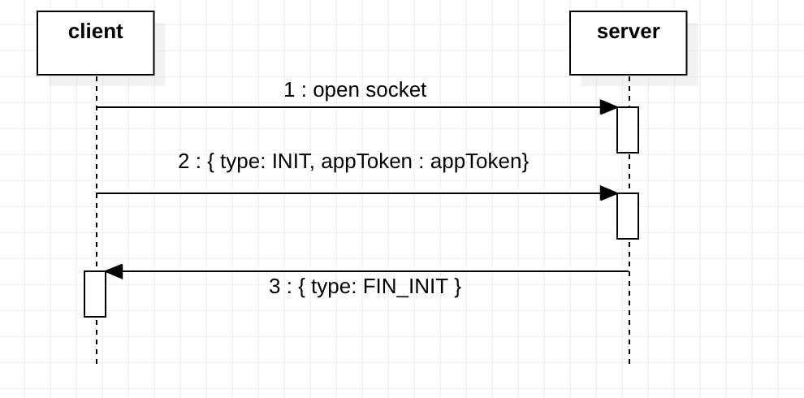

# Signing

Verifiable credential signing is done by the **wallet client** and the keys used are stored client-side using IndexedDB. The issuance and presentation of verifiable credentials is carried out using **websockets** between the client and server.
The wallet backend server initiates the issuance or presentation exchange after it's provided with the selected issuer id or verifier id respectively by the client. The data is then sent through a websocket to the client to be signed and returned to the server to finish the generation of the credential.

## Websocket Initialization Sequence

A websocket will be ready to use to pass data between the server and client at any time after the **handshake** has been made to initialize the connection.

## Websocket Server Services
The websocket part of the signing process is implemented in the wallet-backend-server by `SocketManagerService` and `ClientKeystoreService`.
The former takes care of the basic layer of the websocket funcionality, establishing the handshake and the `send` and `expect` functions, subsequently used by the ClientKeystoreService to dictate the flow of the communication with the client and the `types` of messages of the requests and responses.

## Notes

We're planning to replace websockets with Kafka in the future for better scalability.